## Abstract

**Background.** Spatial transcriptomics enables mapping of gene expression across intact tissue, offering a powerful view of tumor microenvironment (TME) organization. Integrating unsupervised clustering, spatial statistics, and machine learning may identify immune niches and quantify whether neighborhood context improves computational prediction beyond local expression alone.

**Methods.** We analyzed the 10x Genomics Visium demo dataset *Human Breast Cancer (Block A Section 1)* (`V1_Breast_Cancer_Block_A_Section_1`; 3,798 spots) using Scanpy and Squidpy. The pipeline included quality control, normalization, highly variable gene (HVG) selection, Leiden clustering, marker-gene annotation, spatial neighborhood enrichment, and supervised classification of immune-high spots using logistic regression and random forest models—with and without spatial-context features.

**Results.** Leiden clustering at resolution 0.5 identified ten transcriptionally distinct spot communities that mapped to coherent tissue domains. Neighborhood enrichment showed strong diagonal self-enrichment and widespread spatial segregation between clusters. Annotated regions included tumor-like epithelial, immune-rich, stromal-like, and inflammatory immune compartments. Tumor–immune spatial contacts were significantly depleted relative to chance (e.g., tumor-like epithelial vs. immune-rich, *z* = −29.2). Immune-high spots (415/3,798; 10.9%) were predicted from HVG expression with random forest ROC AUC = 0.952; top features included *PTPRC*, *HLA-DPB1*, *C1QA*, and *CCL5*. Adding neighbor expression scores and coordinates increased AUC only marginally (0.952 → 0.954).

**Conclusions.** This Visium breast cancer section exhibits spatially organized transcriptional niches with immune–tumor segregation. Immune hotspots are strongly encoded in local gene expression, and spatial context provides limited additional predictive gain in this single-sample exploratory analysis.

**Keywords:** spatial transcriptomics, Visium, breast cancer, tumor microenvironment, Leiden clustering, Squidpy, machine learning

## Introduction

Breast cancer progression and therapy response are shaped by the spatial organization of epithelial tumor cells, stroma, vasculature, and infiltrating immune populations. Bulk RNA sequencing averages across heterogeneous compartments, whereas spatial transcriptomics preserves location-specific expression at near-single-cell resolution across tissue sections.

The 10x Genomics Visium platform captures mRNA from histologically guided spots (~55 µm) while retaining H&E morphology, making it a standard benchmark for computational method development in cancer spatial biology. Public demo datasets from invasive ductal carcinoma provide an accessible entry point for building reproducible analysis pipelines that connect:

1. **Exploratory QC** - data quality and library complexity per spot  
2. **Unsupervised structure** - transcriptional clusters and UMAP embeddings  
3. **Biological interpretation** - marker genes and compartment labels  
4. **Spatial statistics** - neighborhood enrichment and co-occurrence  
5. **Predictive modeling** - whether expression and/or spatial context identifies immune niches  

Here we present an end-to-end analysis of the Visium breast cancer Block A Section 1 dataset, implemented in Jupyter notebooks and summarized in this Quarto report. Our central biological question is: *how are immune and tumor programs organized in space, and can we predict immune-rich regions computationally?* Our central AI question is: *does incorporating spatial neighborhood information improve immune-hotspot prediction beyond gene expression alone?*

## Methods

### Dataset

- **Sample:** `V1_Breast_Cancer_Block_A_Section_1`  
- **Platform:** 10x Genomics Visium Spatial Gene Expression (v1.1.0)  
- **Tissue:** Fresh frozen invasive ductal carcinoma (Stage IIA; ER+, PR−, HER2+)  
- **Spots under tissue:** 3,798  
- **Source:** [10x Genomics dataset page](https://www.10xgenomics.com/datasets/human-breast-cancer-block-a-section-1-1-standard-1-1-0)

Raw data were downloaded with `squidpy.datasets.visium()` and cached under `data/raw/`. Processed AnnData objects were saved between pipeline stages (`data/processed/`).

### Software environment

Analysis was performed in Python 3.11 using the `spatial-breast-cancer` Conda environment:

| Package | Role |
|---------|------|
| Scanpy ≥1.10 | QC, normalization, PCA, UMAP, Leiden, DE |
| Squidpy ≥1.4 | Visium I/O helpers, spatial graphs, enrichment |
| scikit-learn | Logistic regression, random forest, ROC/AUC |
| leidenalg, python-igraph | Graph-based clustering |

Notebooks: `01`–`07` and `05B` (see repository README). Figures for this report were exported with `scripts/export_report_figures.py`.

### Preprocessing and QC (Notebook 02)

1. Load Visium data; make gene names unique  
2. Compute per-spot QC metrics (`total_counts`, `n_genes_by_counts`)  
3. Filter spots with `min_counts = 1000`; genes detected in `min_cells = 3`  
4. Normalize to `target_sum = 10,000` counts per spot; `log1p` transform  
5. Select top 3,000 HVGs; run PCA  
6. Save `breast_cancer_visium_qc.h5ad`

### Unsupervised clustering (Notebook 03)

1. Load QC object; scale expression (`max_value = 10`)  
2. PCA (`svd_solver = arpack`); neighbor graph (`n_neighbors = 10`, `n_pcs = 30`)  
3. UMAP embedding; Leiden clustering (`resolution = 0.5`, key `leiden_0_5`)  
4. Compare resolutions 0.2–1.0 on UMAP  
5. Project clusters onto H&E image  
6. Save `breast_cancer_visium_clustered.h5ad`

### Marker gene analysis (Notebook 04)

Wilcoxon rank-sum test (`sc.tl.rank_genes_groups`) per `leiden_0_5` cluster. Known TME markers were visualized on UMAP and tissue:

- Epithelial/tumor: *EPCAM*, *KRT8*, *KRT18*  
- Immune: *PTPRC*, *CD3D*, *MS4A1*  
- Stromal: *COL1A1*, *COL1A2*  
- Endothelial: *PECAM1*, *VWF*

### Spatial neighborhood analysis (Notebook 05)

On the clustered object:

- `sq.gr.spatial_neighbors()` - physical proximity graph  
- `sq.gr.nhood_enrichment()` - cluster–cluster enrichment *z*-scores  
- `sq.gr.co_occurrence()` - radial co-occurrence profiles  
- `sq.gr.centrality_scores()` - graph centrality per cluster  

Save `breast_cancer_spatial_analysis.h5ad`.

### Tumor–immune interaction (Notebook 05B)

Leiden clusters were manually annotated into biological regions (e.g., tumor-like epithelial, immune-rich, stromal-like, inflammatory immune, adipose-rich). Neighborhood enrichment was summarized for biologically labeled region pairs and exported to `reports/figures/tumor_immune_interaction_table.csv`.

### Baseline ML - immune hotspot prediction (Notebook 06)

**Target:** binary immune-high label (`immune_score > 1`) from an immune gene signature (*PTPRC*, *CD3D*, *CD74*, *HLA-DRA*, *HLA-DPB1*).

**Features:** 3,000 HVG expression values per spot.

**Models:** logistic regression (balanced class weights, standardized) and random forest (300 trees, `min_samples_leaf = 5`).

**Evaluation:** stratified 75/25 train–test split (`random_state = 42`); classification report and ROC AUC.

### Spatial context model (Notebook 07)

Random forest trained on:

- **Gene-only:** HVG matrix  
- **Gene + context:** HVG matrix plus neighbor-averaged immune/epithelial/stromal scores and spot coordinates  

Same target, split, and hyperparameters as notebook 06.

## Results

### Data quality and tissue overview

Visium loading yielded 3,798 spots × 36,601 genes with spatial coordinates and H&E images attached. Per-spot QC showed expected Visium library complexity across the tissue section (@fig-tissue @fig-counts @fig-genes).

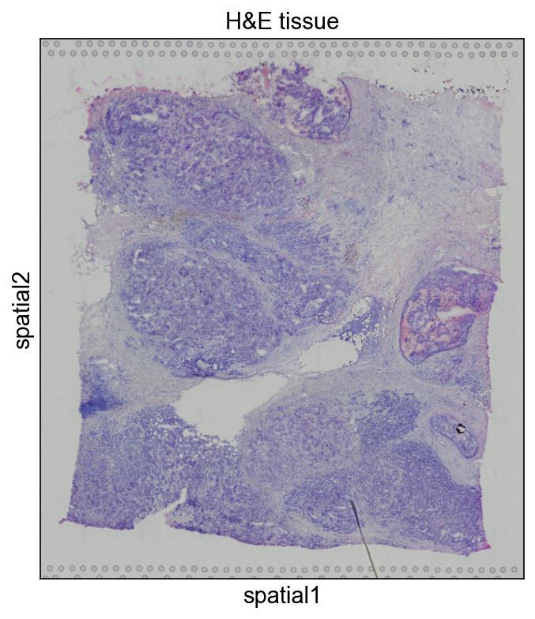{#fig-tissue width=80%}

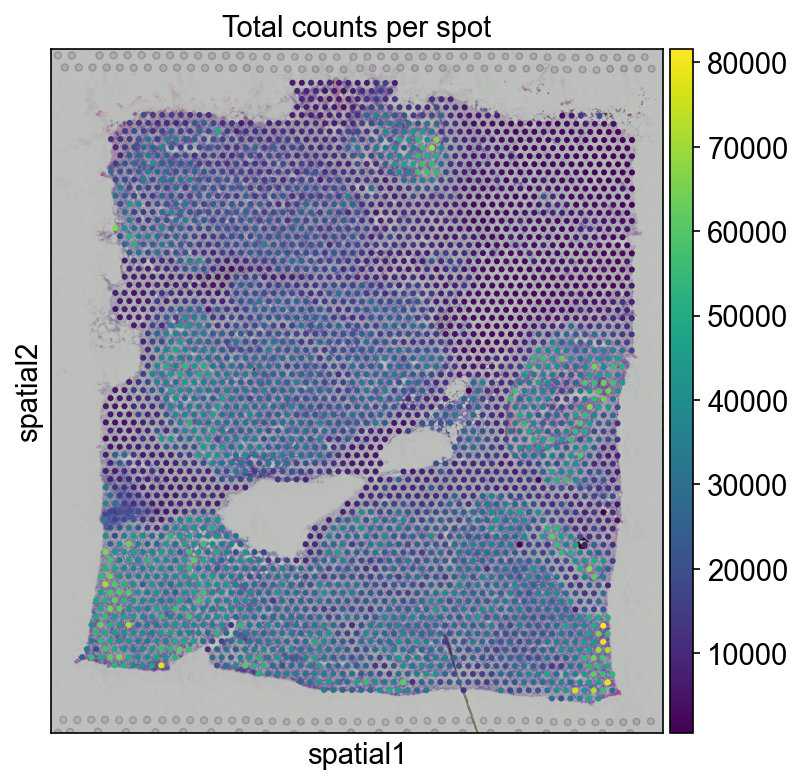{#fig-counts width=80%}

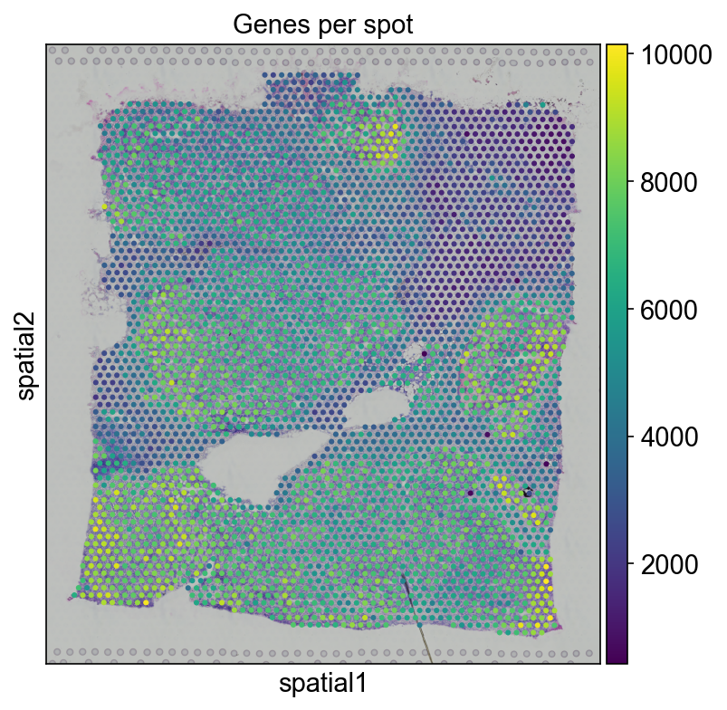{#fig-genes width=80%}

### Unsupervised clustering reveals spatially coherent domains

Leiden clustering (`resolution = 0.5`) partitioned spots into ten clusters that formed contiguous regions in UMAP and on the tissue image (@fig-umap @fig-spatial-clusters). Higher-resolution comparisons (0.2–1.0) showed expected trade-offs between cluster granularity and interpretability; resolution 0.5 was retained for downstream annotation.

{#fig-umap width=75%}

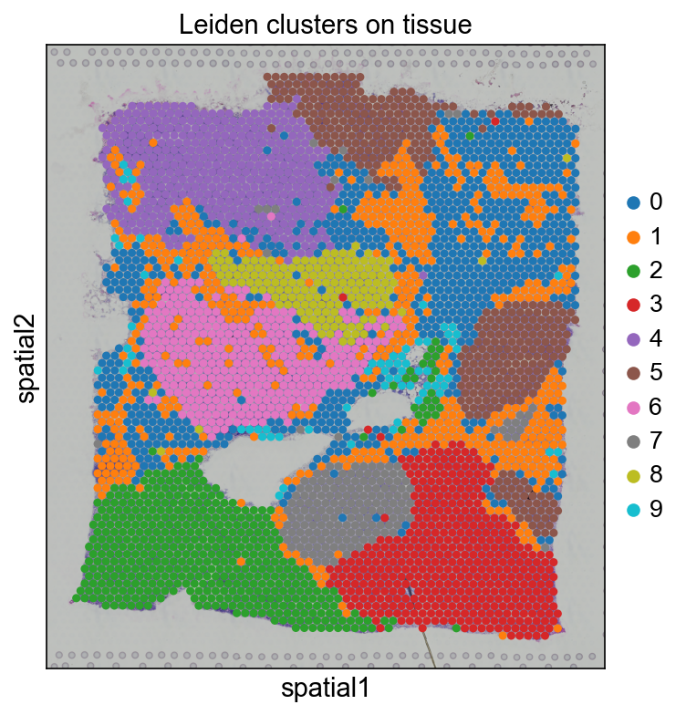{#fig-spatial-clusters width=80%}

### Marker genes support compartment-level interpretation

Differential expression identified cluster-specific transcriptomic programs. Dot plots of canonical markers showed enrichment of epithelial genes in tumor-like clusters, immune markers in lymphoid/myeloid-enriched clusters, and collagen genes in stromal-associated clusters (@fig-markers).

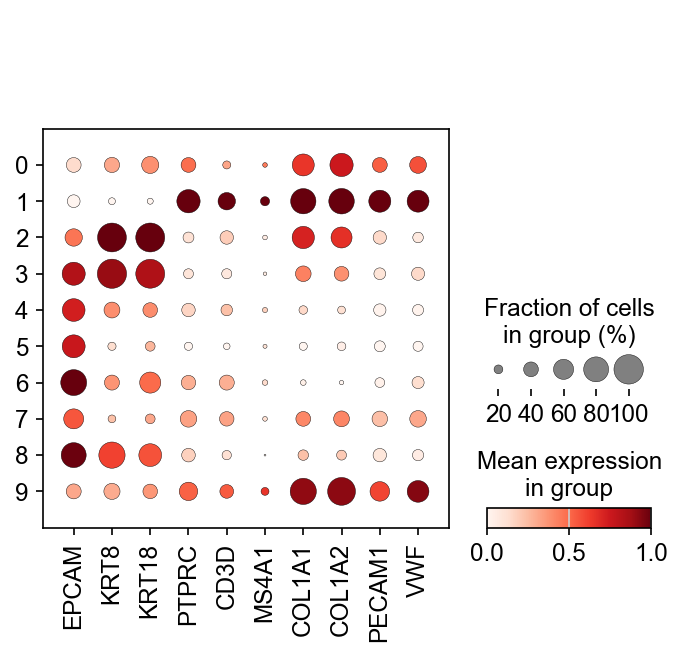{#fig-markers width=90%}

### Spatial neighborhoods show self-enrichment and cross-compartment segregation

Neighborhood enrichment analysis revealed:

- **Strong diagonal self-enrichment** - each Leiden cluster preferentially neighbors itself, confirming spatial coherence of transcriptional domains (@fig-enrichment).  
- **Negative off-diagonal enrichment** - most cluster pairs co-localize less than expected by chance, indicating spatial segregation.  
- **Localized domains** - clusters 2, 3, 4, and 5 showed particularly strong self-enrichment; cluster 9 appeared more dispersed.

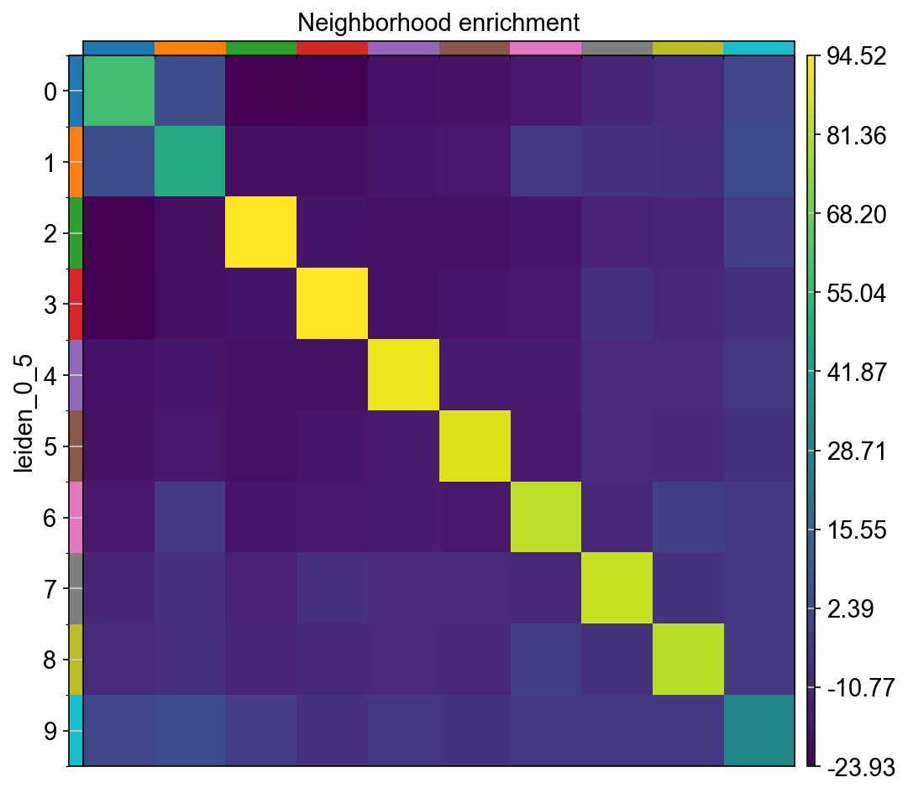{#fig-enrichment width=85%}

Manual biological annotation mapped clusters to interpretable regions (@fig-bio-regions): immune-rich (cluster 1), tumor-like epithelial (2–3), mixed epithelial (4), stromal-like (5), inflammatory immune (6), and adipose-rich (9).

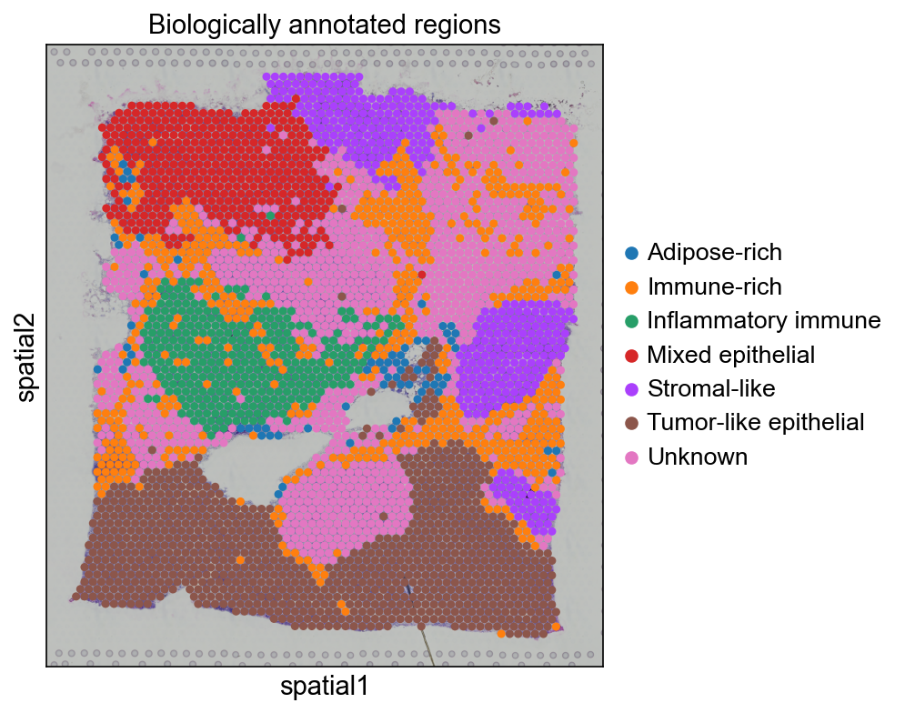{#fig-bio-regions width=80%}

### Tumor and immune compartments are spatially segregated

Region-level neighborhood analysis showed significant **depletion** of tumor–immune adjacency:

| Region A | Region B | Enrichment *z* | Interpretation |
|----------|----------|----------------|----------------|
| Tumor-like epithelial | Immune-rich | -29.20 | Depleted |
| Tumor-like epithelial | Inflammatory immune | -23.93 | Depleted |
| Tumor-like epithelial | Stromal-like | -26.91 | Depleted |
| Immune-rich | Inflammatory immune | -4.33 | Depleted |

These results are consistent with an immune-excluded or compartmentalized architecture in this section, rather than extensive intermingling of tumor and immune spots at Visium resolution.

### Machine learning identifies immune-high spots from expression

Using `immune_score > 1`, we defined 415 immune-high spots (10.9%) versus 3,383 immune-low spots. On held-out test data (*n* = 950):

| Model | Class 1 F1 | ROC AUC |
|-------|------------|---------|
| Logistic regression | 0.54 | 0.903 |
| Random forest | 0.67 | **0.952** |

Random forest substantially outperformed logistic regression for the minority immune-high class (@fig-roc @fig-importance). Top predictive genes were dominated by immune programs:

| Gene | Importance |
|------|------------|
| *PTPRC* | 0.026 |
| *HLA-DPB1* | 0.025 |
| *C1QA* | 0.021 |
| *C3* | 0.020 |
| *LYZ* | 0.020 |

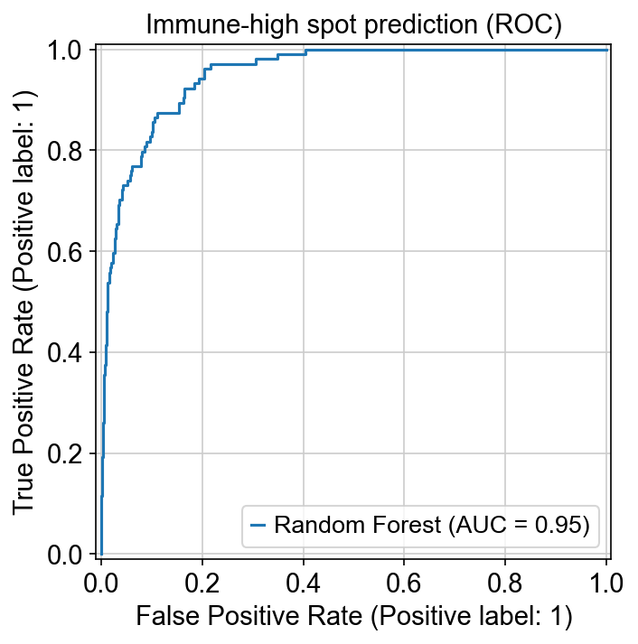{#fig-roc width=70%}

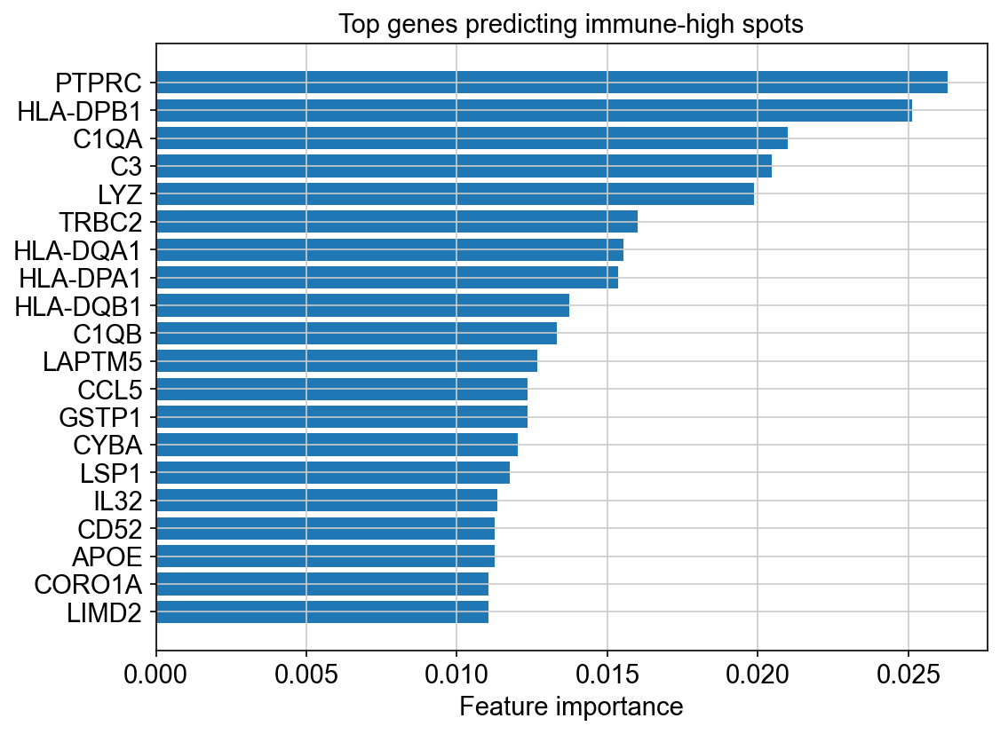{#fig-importance width=80%}

### Spatial context adds minimal predictive value

Comparing gene-only vs. gene + spatial-context random forest models (@fig-auc-compare @fig-roc-compare):

| Model | ROC AUC |
|-------|---------|
| Gene expression only | 0.952 |
| Gene + spatial context | 0.954 |

The modest AUC gain (+0.002) suggests that, in this sample, immune-hotspot identity is already strongly encoded in local HVG expression—likely because immune signature genes are highly informative and spatially autocorrelated.

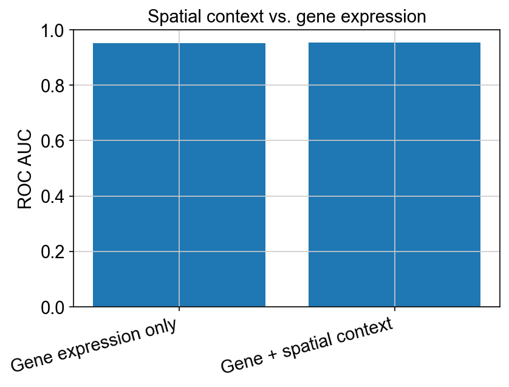{#fig-auc-compare width=75%}

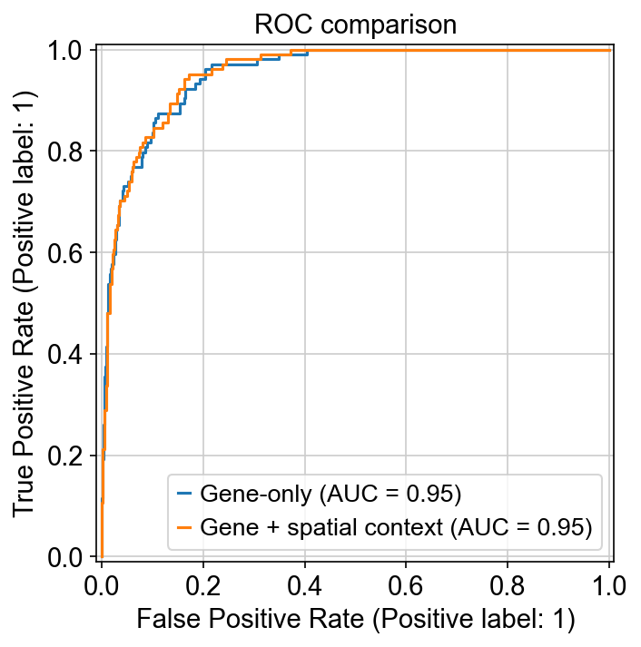{#fig-roc-compare width=75%}

## Discussion

This study presents a reproducible spatial transcriptomics workflow applied to a canonical Visium breast cancer specimen. Three main biological themes emerge:

**First**, unsupervised clustering resolves multiple transcriptionally distinct niches that align with pathological compartments-epithelial tumor, stroma, immune infiltrate, and adipose-adjacent areas. The strong self-enrichment of clusters on the tissue graph indicates that Visium spots capture mesoscale tissue architecture, not random expression noise.

**Second**, tumor-like and immune-rich regions exhibit significant spatial segregation at neighborhood scale. This pattern may reflect immune-excluded phenotype, physical separation by stroma, or sampling geometry at 55 µm spot size. Such organization has implications for immune checkpoint therapy and for interpreting bulk or single-cell datasets lacking spatial coordinates.

**Third**, from a computational perspective, immune-high regions are highly predictable from expression alone (AUC ≈ 0.95). The dominant predictive features (*PTPRC*, HLA genes, complement/macrophage genes) align with biological expectations and with marker analysis. Spatial neighbor features and coordinates did not materially improve performance - possibly because immune signal is locally strong, spots are autocorrelated, and neighbor averages partially recapitulate local expression.

### Relation to prior work

Visium breast cancer data have been widely used in Scanpy/Squidpy tutorials and spatial method benchmarking. Our contribution is an integrated narrative from raw data to spatial statistics to supervised models - framed around TME compartmentalization and immune-hotspot predictability, with open notebooks and exported figures suitable for conference presentation.

## Limitations

1. **Single sample, no clinical outcomes** - one public Visium section without treatment response or survival; findings are hypothesis-generating only.  
2. **Spot-level resolution** - Visium spots average multiple cells; cluster labels reflect spot mixtures, not pure cell types.  
3. **Manual cluster annotation** - biological region labels are curator-defined and could be refined with automated reference mapping (e.g., cell2location, RCTD).  
4. **Immune-high threshold** - binary labeling used `immune_score > 1` without systematic calibration; class imbalance (10.9% positive) affects precision/recall trade-offs.  
5. **No spatial cross-validation** - random spot splits may inflate performance due to spatial autocorrelation; spatially aware CV would provide more conservative estimates.  
6. **Linear neighborhood features** - neighbor averaging and coordinates are simple; graph neural networks or attention over spatial graphs may capture richer context in larger cohorts.  
7. **Batch and cohort generalization** - models were not tested on external Visium samples.

## Future Work

- **Expand cohort** - analyze additional breast cancer Visium sections (e.g., Block A Section 2, targeted panels) and harmonize across patients.  
- **Cell-type deconvolution** - integrate reference-based methods to estimate epithelial, lymphoid, myeloid, and fibroblast abundances per spot.  
- **Spatial statistics** - ligand–receptor analysis (e.g., Squidpy L-R), boundary detection, and immune exclusion metrics.  
- **Rigorous ML** - spatial block cross-validation, calibration curves, SHAP interpretability, and comparison with graph neural networks.  
- **Multi-modal integration** - align H&E morphology features (CNN embeddings) with expression for joint niche discovery.  
- **Clinical translation** - correlate spatial immune metrics with grade, receptor status, and treatment response in appropriately consented cohorts.

## Reproducibility

```bash
# Export figures referenced in this report
python scripts/export_report_figures.py

# Render HTML or PDF (requires Quarto CLI)
quarto render reports/conference_report.qmd
```

Notebook pipeline: `01` → `02` → `03` → `04` → `05` → `05B` → `06` → `07`.

## References

::: {#refs}
:::
